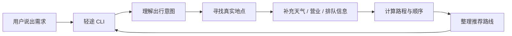

# 🧭 LightRoute 轻途

> 城市短途出行智能规划助手：说出一句想法，轻途帮你整理成一条能出发的本地小路线。

[](https://www.python.org/)
[](https://lbs.amap.com/)
[](#运行方式)
[](#已知问题与改进方向)

**🏷️ 项目代号：LightRoute 轻途**

---

## 💬 一句话介绍

LightRoute 轻途是一个面向城市内短途游、下班放松、约会、citywalk 和朋友小聚的智能路线助手。用户不用自己查地点、比距离、算时间、看营业状态，只需要用自然语言说出需求，系统就会生成一条推荐路线和多条备选路线。

📌 示例：

```text
北京短途游，从国贸出发，6小时，想吃本地特色，不想排队
```

轻途会理解这句话里的出发地、时间、偏好、排队顾虑和活动目标，并整理出更适合真实出发的路线。

## 🌆 为什么需要轻途

很多城市出行并不是“我要规划一次完整旅行”，而是一个更日常的问题：

- 🌙 下班后想按摩放松，再吃点夜宵。
- 💅 周末下午想和朋友做美甲、喝点小酒。
- 🌧️ 下雨了，想和女朋友看展，再找一个安静小酒馆。
- 🚶 从天安门附近出发，想轻松 citywalk 三小时。
- 🍜 从国贸出发，想吃北京本地特色，但不想排长队。

这些场景看起来简单，实际很容易踩坑：

| 用户要解决的问题 | 普通搜索/普通大模型容易出现的情况 | 轻途的处理方式 |
| --- | --- | --- |
| 📍 地点是否真实 | 推荐听起来合理，但地点可能不适合当前城市或场景 | 优先使用真实地图地点 |
| 🧭 顺序是否顺路 | 几个地点都不错，但串起来绕路 | 根据真实路程和时间重新排序 |
| ⏳ 时间是否够用 | 3 小时路线被排成半日游 | 用时间预算过滤和评分 |
| 🌦️ 是否适合当下 | 雨天还安排大量户外活动 | 结合天气调整推荐倾向 |
| 🪑 是否容易排队 | 热门餐厅被推荐，但等待时间不可控 | 把排队风险作为重要因素 |
| 🕒 是否能营业 | 推荐地点可能已经关门 | 营业状态会参与筛选和提醒 |

## 👥 适合谁使用

- 🏠 **本地用户**：临时想安排下班后、周末下午、雨天约会、朋友小聚等短时活动。
- 🧳 **城市游客**：不熟悉本地商圈，希望从一个地标出发，快速得到一条合理路线。
- 💞 **情侣 / 朋友 / 闺蜜 / 独自出行者**：希望路线既有主题，又不用自己反复查地点。

## 🚀 项目亮点

### ✨ 功能亮点

| 亮点 | 简单来说 | 用户得到什么 |
| --- | --- | --- |
| 🏙️ 专为本地短途出行打造 | 不做泛泛的旅游攻略，而是关注 3-6 小时内的城市小路线 | 下班放松、雨天约会、citywalk、美食打卡、闺蜜小聚都能覆盖 |
| 🎯 预设路线偏好 | 用户可以选择美食、打卡、景点餐饮兼顾，也可以交给系统自动判断 | 少输入、少纠结，更快得到符合心情的路线 |
| 🗺️ 路线真实且有顺序 | 不只是推荐几个地点，而是从出发地开始串成可走路线 | 知道先去哪、怎么走、大概花多久 |
| 🌦️ 会考虑现实因素 | 天气、营业时间、排队风险、交通方式都会影响推荐 | 路线更贴近真实出发，不容易“看着好但走不了” |
| 🧠 越用越像私人助手 | 支持用户偏好记忆，不同用户拥有独立记录 | 下次规划时能更贴近个人习惯 |
| ⏱️ 过程透明可见 | 规划时会展示正在理解需求、寻找地点、整理路线等进度 | 不用干等，知道系统正在做什么 |
| ✍️ 支持随时调整 | 规划过程中可以 `/edit` 修改需求，也可以 `/cancel` 取消 | 临时改变想法也能接住 |

### 🛠️ 系统设计亮点

| 设计亮点 | 价值 |
| --- | --- |
| 🧩 能力插件化 | 出行信息整理、偏好读取、地点检索、路线计算、结果整理各司其职，后续扩展新能力更容易。 |
| ⚡ 可并行的工作流程 | 能同时处理不互相依赖的任务，减少用户等待时间。 |
| 🧠 双层记忆系统 | 短期记忆服务当前对话，长期记忆保存用户偏好和历史行程。 |
| 🧯 健康检查与安全熔断 | 服务异常时及时保护主流程，避免一直等待或反复失败。 |
| 🧪 可测试、可复现 | 路线计算由确定性工具完成，便于用纯 Python 脚本验证结果。 |
| 🔍 失败可解释 | 如果路线无法生成，会给出原因和调整建议，而不是硬编一个看似完整的结果。 |

### 🌟 一句话总结

轻途的重点不是“生成一段看起来不错的文字”，而是把真实地点、用户偏好、现实约束和路线顺序一起考虑，让用户拿到一条更接近真实出发的城市小路线。

## 🧰 核心功能

| 功能 | 你能感受到的效果 |
| --- | --- |
| 💬 一句话规划路线 | 直接输入“北京，从国贸出发，6小时，想吃本地特色，不想排队”，系统自动整理出路线。 |
| 🧭 自动理解出行场景 | 能识别 citywalk、下班放松、情侣雨天约会、闺蜜美甲小酒、拍照打卡、美食短途等场景。 |
| 🎚️ 支持路线偏好 | 可选择美食优先、打卡优先、景点餐饮兼顾，也可以让系统自动判断。 |
| 📍 真实地点推荐 | 推荐结果来自真实地图地点，不是随口编造的地点名称。 |
| 🗺️ 路线顺序规划 | 不只是列几个地点，而是按出发地、距离、时间和活动顺序整理成可走路线。 |
| 🌦️ 天气和营业提醒 | 雨天、营业时间不明确、可能排队等情况会体现在提醒里。 |
| 🧾 多条备选路线 | 给出一条主推荐路线，同时保留其他候选方案，便于用户选择。 |
| 🧠 多用户偏好记忆 | 每个用户 ID 拥有独立记忆，适合多人使用和连续演示。 |

## 🎬 示例输入输出

📝 输入：

```text
北京短途游，从国贸出发，6小时，想吃本地特色，不想排队
```

📍 输出摘要：

```text
LightRoute 轻途 | 北京智能路线规划
把你的需求整理成下面这条可出发的小路线。

本次识别
--------
场景: 美食短途路线
出发: 国贸
时间: 6小时
顺序: 本地特色美食 -> 轻松步行 -> 低排队餐饮

短时路线安排
------------
1. 14:00  本地特色餐厅
   推荐理由: 符合北京特色，排队风险较低。
   交通建议: 从国贸出发，步行或骑行前往。

2. 15:30  轻松散步街区
   推荐理由: 用低强度活动连接路线，避免连续用餐。
   交通建议: 步行约 10 分钟。

3. 17:00  低排队特色小吃
   推荐理由: 适合作为收尾餐饮点。

备选路线
--------
- 少排队美食路线: 餐厅 A -> 街区 B -> 小吃 C
  用时约 5小时30分钟，大概率不用久等，预算约 180 元

出行提醒
--------
- 部分地点营业时间暂不明确，出发前建议再次确认。
- 现场排队情况可能变化，建议保留 10-15 分钟弹性。
```

🎞️ 更多演示案例：

```text
我在天安门，想要进行3小时的citywalk，请为我推荐一条轻松的路线
```

```text
下雨了，想和女朋友在北京约会，看看展览，再找个安静小酒馆，4小时
```

```text
今天下午无事可做，和闺蜜想去做指甲和点小酒，大概5小时行程
```

## 🧭 系统如何工作（技术路线）



简单来说，轻途的规划过程分为五步：

1. 🧠 理解用户想做什么：吃饭、散步、拍照、看展、放松、约会等。
2. 🎯 识别关键限制：出发地、城市、时间、同行人、天气、交通方式、是否排队。
3. 📍 找到真实地点：优先使用地图服务返回的真实地点。
4. 🗺️ 计算路线是否合理：比较距离、时间、活动顺序和预算。
5. 🧾 输出人能看懂的方案：给出主路线、备选路线和出行提醒。

## 🧪 技术可信度

为了让路线结果更可靠，项目内部保留了可解释、可测试的工程链路：

- 🧠 大模型主要负责理解需求，不直接凭空编路线。
- 🧩 地点检索和路线规划是独立工具，便于测试和复现。
- ⚖️ 路线规划会综合时间、距离、交通方式、天气、营业状态、地点质量和用户偏好。
- 🚩 起点会进入路线计算，避免只推荐一组地点却忽略“从哪里出发”。
- 🔍 失败时会给出可诊断原因，不会强行生成看似完整但不可执行的路线。

## ⚙️ 运行方式

### 🪟 Windows PowerShell

```powershell
python -m venv .venv
.\.venv\Scripts\Activate.ps1
python -m pip install --upgrade pip
python -m pip install -r requirements.txt

$env:LLM_API_KEY="your-llm-api-key"
$env:LLM_MODEL_NAME="your-model-name"
$env:LLM_BASE_URL="https://your-llm-endpoint/v1"
$env:AMAP_WEB_SERVICE_KEY="your-amap-web-service-key"

python cli.py
```

### 🍎 Linux / macOS

```bash
python3 -m venv .venv
source .venv/bin/activate
python -m pip install --upgrade pip
python -m pip install -r requirements.txt

export LLM_API_KEY="your-llm-api-key"
export LLM_MODEL_NAME="your-model-name"
export LLM_BASE_URL="https://your-llm-endpoint/v1"
export AMAP_WEB_SERVICE_KEY="your-amap-web-service-key"

python cli.py
```

### 🩺 健康检查

```bash
python cli.py health
```

### ✅ 推荐验证脚本

项目使用纯 Python 脚本进行检查：

```bash
python tests/test_tool_registry.py
python tests/test_cli_route_preference_choice.py
python tests/test_route_preference_modes.py
python tests/run_beijing_short_trip_checks.py
python tests/run_urban_micro_trip_scenario_coverage.py
```

## 📦 依赖环境

- 🐍 Python 3.11+
- 🗺️ AMap Web Service Key，用于地点、地理编码和路线服务
- 🔑 模型服务 API Key，用于自然语言需求理解
- 🌐 网络访问：地图服务、模型服务、可选天气服务

🔒 请不要把真实 key 写入 README、截图、视频或公开仓库。

## 🗂️ 目录结构

```text
LightRoute/
  cli.py                         # 命令行入口和用户展示
  config.py                      # 配置读取
  agents/
    intention_agent.py           # 需求理解
    orchestration_agent.py       # 任务编排
    lazy_agent_registry.py       # 能力懒加载
  tools/
    registry.py                  # 工具注册
    poi_search_tool.py           # 真实地点检索与补充信息
    route_planning_tool.py       # 路线计算、排序和评分
  services/
    amap_client.py               # 地图服务封装
    weather_client.py            # 天气上下文
    ugc_service.py               # 用户评价与标签补充
    opening_hours.py             # 营业时间处理
  context/
    memory_manager.py            # 长短期记忆入口
    short_term_memory.py         # 当前会话记忆
    long_term_memory.py          # 用户长期偏好
  data/
    memory/                      # 用户记忆
    ugc/                         # 示例评价数据
    models/                      # 本地模型资源
  docs/                          # 技术方案、部署、演示脚本
  tests/                         # 纯 Python 检查脚本
```

## 📚 文档导航

- 🧠 [技术方案](docs/technical_solution.md)
- 👋 [用户使用手册](docs/user_manual.md)
- 🚀 [部署文档](docs/deployment.md)
- 🎥 [视频演示脚本](docs/demo_script.md)
- 🧭 [架构图与核心链路](docs/architecture.md)

## 🛣️ 已知问题与改进方向

当前版本已经具备比赛演示所需的主链路，但仍有几个高层次方向可以继续完善：

1. 📊 **数据覆盖度继续提升**  
   当前已接入真实地图服务，并结合本地评价数据和启发式规则补充排队、适合人群等信息。后续可以接入更完整、更稳定的真实评价与营业时间数据源。

2. 🗺️ **展示形态继续升级**  
   当前以 CLI 展示为主，适合比赛现场说明核心链路。后续可以增加 Web 页面和地图可视化，让路线、距离和备选方案更直观。

3. 🔁 **交互闭环继续增强**  
   当前支持规划中修改和取消。后续可以进一步支持“换一家更近的餐厅”“不要商场”“多安排胡同”“预算再低一点”等结果级微调。

4. 🔐 **部署和安全继续加固**  
   当前适合本地运行和比赛演示。后续在生产部署时，需要进一步完善密钥管理、日志监控、异常告警和访问控制。

## 🌟 适合展示的核心总结

LightRoute 轻途的优势不是“给出一段漂亮文案”，而是把城市短途出行真正拆成了可理解、可筛选、可计算、可解释的路线生成过程。它让用户少做选择，让路线更贴近真实出发。
