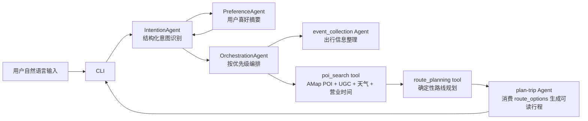
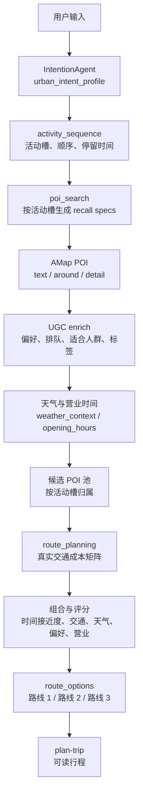

# LightRoute 轻途架构与真实边界

本文档用于对外汇报当前项目架构。核心原则是：LLM 负责理解和表达，工具负责真实地点召回与确定性路线规划。

## 1. 主链路架构图

说明：

- `CLI` 是用户交互入口，负责接收自然语言、偏好选项、起点追问、进度展示和最终输出。
- `PreferenceAgent` 和长期记忆提供用户喜好摘要，例如常用出发地、食物偏好、活动偏好；这些信息进入意图识别和 POI 召回，但不直接生成路线。
- `IntentionAgent` 使用 LLM 做结构化意图识别，输出机器可消费的 JSON，不直接编路线。
- `OrchestrationAgent` 只负责编排和传递上下文，不承担 POI 召回算法和路线规划算法。
- `event_collection Agent` 整理城市、起点、时间窗口等出行基础信息。
- `poi_search tool` 是真实 POI 召回工具，融合 AMap、UGC、天气和营业时间。
- `route_planning tool` 是确定性路线规划工具，消费 POI 和真实交通代价矩阵，输出 `route_options`。
- `plan-trip Agent` 只消费 `route_options` 生成可读行程，不重新召回地点，不重新计算路径，不替换主路线。

## 2. 模块真实边界

| 模块 | 当前真实职责 | 明确不做 |
| --- | --- | --- |
| `cli.py` | 命令行交互、路线偏好选择、缺起点追问、记忆上下文注入、进度与最终展示 | 不做 POI 搜索算法，不做路线求解 |
| `agents/intention_agent.py` | 用 LLM 将自然语言转成结构化意图、活动序列、时间窗口、交通模式、召回提示 | 不选具体 POI，不计算路线，不生成最终行程文案 |
| `.claude/skills/preference` | 识别和保存用户显式偏好，沉淀长期记忆 | 不直接决定路线，不跳过当前用户请求 |
| `context/memory_manager.py` | 长期记忆读写、摘要缓存、偏好注入 | 不调用地图服务，不做路径规划 |
| `agents/orchestration_agent.py` | 按 `agent_schedule` 调度 event、POI、route、plan-trip，聚合结果和失败诊断 | 不自己召回 POI，不自己排序路线 |
| `.claude/skills/event-collection` | 整理出行基础字段，如城市、日期、时长、起点 | 不生成真实地点列表 |
| `tools/poi_search_tool.py` | 生成 recall specs，调用 AMap，补 UGC、天气、营业时间，返回候选 POI | 不生成路线顺序，不做最终行程 |
| `tools/route_planning_tool.py` | 读取候选 POI，构建真实路径代价矩阵，做组合、排序、评分，输出 `route_options` | 不调用 LLM，不重新召回 POI |
| `.claude/skills/plan-trip` | 消费 `route_options`，整理为用户可读路线、提醒、备选方案 | 不替换 POI，不改变顺序、距离、时长和交通方式 |
| `services/amap_client.py` | AMap POI、地理编码、真实路线代价服务 | 不做业务规划 |
| `services/weather_client.py` | 天气上下文结构化查询 | 不决定路线，只提供评分因素 |
| `services/ugc_service.py` | 从本地 UGC 数据补充标签、排队、适合人群、推荐理由 | 不替代真实 POI 来源 |

## 3. Prompt 设计边界

### 3.1 IntentionAgent Prompt 思路

`IntentionAgent` 是主链路中最重要的 LLM 使用点。它的目标不是“直接写一条路线”，而是把用户一句自然语言变成稳定的结构化 JSON。

Prompt 重点约束：

- 只输出 JSON，避免解释性长文。
- 保留开放活动类型，不把所有需求强行归为“美食线 / 打卡线 / 均衡线”。
- 识别城市微行程场景，例如下班放松、夜宵、小酒馆、展览、citywalk、约会、同学聚会、闺蜜局。
- 输出 `urban_intent_profile`，包含 `scenario`、`time_context`、`weather_context`、`companions`、`social_context`、`transport_mode`、`activity_sequence`、`route_constraints`。
- 用户未指定交通方式时，应输出 `multimodal_low_friction`，表示步行、骑行、公共交通都可作为候选方式。
- 用户明确说 citywalk、散步、骑车、开车、电动车时，交通方式必须传递到后续路线矩阵。
- 当前用户输入优先级最高；长期记忆和偏好只能作为软上下文，不能覆盖当前明确需求。
- 输出 `agent_schedule`，让编排器知道后续该调用 event、poi、route、plan-trip。

它不做的事：

- 不选择最终 POI。
- 不计算两点距离或时间。
- 不生成最终路线排序。
- 不把模型幻想出的地点当成真实地点。

### 3.2 plan-trip Agent Prompt 思路

`plan-trip Agent` 位于路线规划之后。它的输入已经包含 `route_options`，所以它的 Prompt 设计核心是“解释和包装”，不是“重新规划”。

Prompt 重点约束：

- 必须消费 `route_options` 中的地点、顺序、距离、时长、交通方式、warnings。
- 不允许替换主要 POI。
- 不允许擅自增加未在 route options 中出现的主活动地点。
- 不允许把路线 1、路线 2、路线 3 改成带专业术语的内部标题。
- 中文输出要面向普通用户，避免暴露 `activity_slot_quality_filtered`、`route_cost_matrix`、`optimization_profile` 等工程术语。
- 可润色标题、摘要、出行提醒和过渡表达，但不能改变结构化路线事实。

当前实现中，`plan-trip` 有 route options 时优先走确定性组装逻辑；Prompt 只作为兜底或窄范围文案整理使用。

## 4. 城市微行程数据流

关键点：

- `activity_sequence` 是城市微行程的核心结构。它能表达“按摩 -> 夜宵”、“展览 -> 小酒馆”、“美甲 -> 小酒”、“吃饭 -> 散步”等顺序。
- `poi_search` 会按活动槽召回，不是一组关键词搜到底。
- `route_planning` 会按活动槽顺序选点，计算从起点到第一个 POI、POI 到 POI 的真实交通成本。
- 最终路线至少支持 3 个 POI 串联的展示要求；如果用户时间较长，评分会鼓励路线更接近用户期望时长。
- 时间预算是评分因素，不应轻易把路线直接停掉；但关键数据缺失或真实路径服务不可用时，应输出可诊断失败。

## 5. 交通模式边界

`transport_mode` 从意图识别传递到路线规划：

- `walking`：citywalk、散步、明确步行时使用。
- `bicycling`：用户明确骑行时使用。
- `driving`：用户明确开车时使用。
- `electrobike`：用户明确电动车时使用。
- `transit`：用户明确公交、地铁、公共交通时使用。
- `multimodal_low_friction`：用户未指定交通方式时默认使用，允许 walking / bicycling / transit 作为候选。

在 `multimodal_low_friction` 中，路线规划不是只拿一种方式，而是为两点之间计算多个候选交通方式，再按不同目标选择，例如：

- 总耗时更短。
- 总距离更短。
- 换乘更少。
- 步行更少。
- 天气更适配。
- 路线整体更接近期望时长。

雨天、雷雨、大风、高温等天气会进入评分：长距离步行和骑行会被降权，但短接驳步行仍然允许。

## 6. 失败与诊断边界

主链路应暴露真实失败，而不是用虚假结果掩盖问题。

常见失败点：

- 意图识别失败：JSON 不完整、缺 `urban_intent_profile`、缺 `transport_mode`。
- 缺起点：CLI 应追问；工具层仍缺失时返回 `missing_start_or_anchor`。
- POI 召回失败：某个必须活动槽没有可用 POI，返回 `required_activity_slot_empty`。
- 路径矩阵失败：真实地图路线服务不可用，返回 `route_cost_matrix_failed`。
- route options 为空：返回 `no_route_options`。
- plan-trip 缺路线：返回 `itinerary_missing_route_options`。

这些错误应该在 CLI 中转成用户能理解的话，同时保留结构化诊断写入日志，不能打印 API key。

## 7. 汇报口径

一句话版本：

LightRoute 轻途把 LLM 用在“理解用户要什么”，把真实地图和确定性算法用在“找到真实地点并排出可走路线”，最后再由 plan-trip 把结构化路线翻译成用户能直接出发的中文行程。

更技术一点的版本：

系统将自然语言解析为 `urban_intent_profile` 和 `activity_sequence`，再由 `poi_search` 召回真实 POI 并补充 UGC、天气、营业时间，随后由 `route_planning` 基于真实交通代价矩阵生成多条 `route_options`，最后 `plan-trip` 只负责可读化展示，确保 LLM 不越界重编路线。
