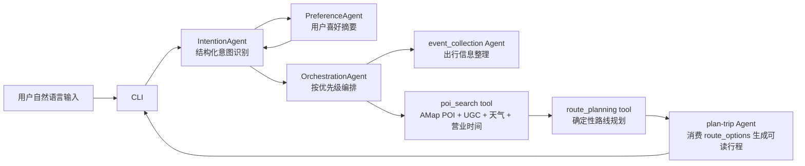

# LightRoute 轻途当前项目结构报告

更新时间：2026-06-07

本文档面向团队汇报，描述当前代码结构、主链路、Agent / Tool 边界和后续维护入口。

## 1. 当前定位

LightRoute 轻途当前主攻城市内短途游 / 微行程规划：

- 用户只需要输入一句自然语言，例如“从国贸出发，5小时，想吃川菜再轻松逛逛”。
- 系统先理解意图，再召回真实 POI，然后用真实交通成本生成路线。
- LLM 不直接编路线；路线由工具和确定性算法生成。
- 最终输出给用户的是路线 1、路线 2、路线 3，而不是内部评分名或工程术语。

## 2. 当前主链路

```text
用户自然语言输入
  -> cli.py
  -> agents/intention_agent.py
  -> context/memory_manager.py / .claude/skills/preference
  -> agents/orchestration_agent.py
  -> .claude/skills/event-collection
  -> tools/poi_search_tool.py
  -> tools/route_planning_tool.py
  -> .claude/skills/plan-trip
  -> cli.py 输出
```

对应架构：



## 3. 目录与文件职责

| 路径 | 职责 |
| --- | --- |
| `cli.py` | CLI 入口；用户交互、路线偏好选择、起点追问、进度展示、结果渲染、偏好上下文注入 |
| `agents/intention_agent.py` | LLM 结构化意图识别；输出 `urban_intent_profile`、`route_preference`、`agent_schedule` |
| `agents/orchestration_agent.py` | 主编排器；根据 schedule 调用 event、POI、route、plan-trip |
| `agents/lazy_agent_registry.py` | 懒加载 `.claude` skill wrapper |
| `context/memory_manager.py` | 长期记忆摘要、缓存、用户偏好读写入口 |
| `context/long_term_memory.py` | 长期记忆存储实现 |
| `.claude/skills/preference` | PreferenceAgent；显式偏好识别和写入 |
| `.claude/skills/event-collection` | 出行信息整理 Agent |
| `.claude/skills/plan-trip` | 行程可读化 Agent；消费 `route_options` |
| `tools/registry.py` | 工具注册表；统一调用工具 |
| `tools/poi_search_tool.py` | POI 召回主实现；AMap + UGC + 天气 + 营业时间 + 偏好软加权 |
| `tools/route_planning_tool.py` | 路线规划主实现；真实路径矩阵、活动槽约束、组合、评分、`route_options` |
| `services/amap_client.py` | AMap POI、地理编码、路线代价客户端 |
| `services/weather_client.py` | 天气查询和结构化天气上下文 |
| `services/opening_hours.py` | 营业时间解析与判断 |
| `services/ugc_service.py` | 本地 UGC 标签、排队、适合人群、提示补充 |
| `data/ugc/` | 本地 UGC mock 数据 |
| `data/memory/` | 用户长期记忆数据 |
| `tests/` | 纯 Python 回归、snapshot、smoke 脚本 |
| `docs/technical_solution.md` | 技术方案说明 |
| `docs/architecture.md` | 架构和真实边界图 |

## 4. Agent 与 Tool 分工

### 4.1 Agent 层

Agent 层负责理解、编排和表达。

- `IntentionAgent`：理解用户自然语言，产出结构化字段。
- `PreferenceAgent`：识别和保存用户偏好，例如“我爱吃川菜”、“我喜欢安静的小酒馆”。
- `event_collection Agent`：整理城市、起点、日期、时长等基础信息。
- `OrchestrationAgent`：按优先级调度各模块。
- `plan-trip Agent`：把 `route_options` 转成中文可读行程。

Agent 层不应承担：

- 真实 POI 召回算法。
- 两点之间交通成本计算。
- 路线组合枚举和评分排序。
- 随意替换工具层已经选出的地点。

### 4.2 Tool 层

Tool 层负责真实、可重复、可测试的业务能力。

- `poi_search`：根据结构化意图和偏好召回真实 POI。
- `route_planning`：根据 POI 和真实交通成本生成路线。

Tool 层不应承担：

- 自然语言长文解释。
- LLM prompt 推理。
- 用户界面展示。

## 5. IntentionAgent 输出与用途

`IntentionAgent` 的核心输出：

| 字段 | 用途 |
| --- | --- |
| `intents` | 告诉编排器这是路线规划、信息查询还是偏好管理 |
| `key_entities` | 城市、地点、时间、活动、人群等基础实体 |
| `rewritten_query` | 给后续工具使用的规整查询 |
| `route_preference` | 兼容旧路线偏好：打卡、美食、均衡、自动 |
| `urban_intent_profile` | 当前城市微行程主结构 |
| `agent_schedule` | 后续调用 event、poi、route、plan-trip 的计划 |

`urban_intent_profile` 是新主结构，通常包含：

```json
{
  "scenario": "urban_micro_trip",
  "time_context": {},
  "weather_context": {},
  "companions": [],
  "social_context": {},
  "transport_mode": {},
  "activity_sequence": [],
  "route_constraints": {}
}
```

这些字段的去向：

- `time_context`：用于 event、POI 营业时间判断、路线总时长评分。
- `weather_context`：用于 POI 召回词、户外/室内权重、交通方式降权。
- `companions` / `social_context`：用于召回适合约会、同学、闺蜜、同事、亲子等场景的 POI。
- `transport_mode`：用于 route planning 选择 walking、bicycling、transit、driving 或 multimodal。
- `activity_sequence`：用于 POI 按活动槽召回，并在 route planning 中固定活动顺序。
- `route_constraints`：用于少排队、低强度、少换乘、接近期望时长等评分。

## 6. POI 召回实现思路

文件：`tools/poi_search_tool.py`

当前 POI 召回不是一个关键词搜到底，而是按活动槽生成多路召回：

1. 读取 `urban_intent_profile.activity_sequence`。
2. 每个活动槽生成 recall specs。
3. 融合用户当前输入、偏好记忆、天气、同行人、社交氛围、时间段。
4. 有起点时优先做起点附近召回。
5. 调用 AMap 获取真实 POI。
6. 对结果补充 UGC、营业时间、天气适配、活动槽匹配信息。
7. 如果某个 required 活动槽候选不足，再做 targeted retry。
8. 返回候选 POI 池和结构化 diagnostics。

偏好如何影响 POI 召回：

- 偏好不是硬过滤，而是软加权和补充召回词。
- 例如用户记忆中有“爱吃川菜”，在“吃点我爱吃的”这类输入中，应追加川菜相关 recall specs，并提高川菜 POI 的优先级。
- 当前用户明确说的内容优先级高于历史偏好。
- 历史偏好不能替代当前没有说出的必需活动，只能增强召回。

## 7. 路径规划实现思路

文件：`tools/route_planning_tool.py`

路线规划是确定性工具，不调用 LLM。

核心步骤：

1. 读取 `poi_search` 返回的 POI 候选。
2. 读取起点、活动序列、时长、交通模式、天气、用户偏好。
3. 将起点作为虚拟首节点纳入矩阵。
4. 为 POI pair 构建真实交通成本矩阵。
5. 如果有 `activity_sequence`，按活动顺序选点，不反转 required 槽位。
6. 枚举或构造候选组合。
7. 计算总停留时间、总交通时间、总距离。
8. 根据活动匹配、POI 质量、偏好、天气、营业时间、交通、时长接近度等评分。
9. 输出最多 3 条 `route_options`。

交通模式：

- 用户明确 citywalk / 散步时，使用步行为主。
- 用户明确开车、骑车、电动车、公交地铁时，按对应方式构建代价。
- 用户未指定时，使用 `multimodal_low_friction`，在 walking / bicycling / transit 中选择低阻力组合。
- 雨天、雷雨、大风、高温时，长距离步行和骑行降权，但短接驳步行保留。

时长策略：

- 用户给出的时长是重要评分目标。
- 不应因为略超时或略短就直接删除路线。
- 路线应尽量接近期望时长；明显短于 5 或 6 小时的路线应在评分上吃亏。
- 用户要求较长行程时，应鼓励增加合适 POI 或更完整的活动串联。

## 8. plan-trip 展示边界

文件：`.claude/skills/plan-trip/script/agent.py`

`plan-trip` 的职责是把路线规划结果变成人能读懂的行程。

有 `route_options` 时：

- 优先使用确定性组装逻辑。
- 输出路线 1、路线 2、路线 3。
- 展示出发地、时段、用时、距离、天气、交通、活动顺序。
- 展示每段交通方式和耗时。
- 将工程 warning 转成用户能理解的出行提醒。

不允许：

- 输出 `balanced`、`activity_slot_quality_filtered`、`optimization_profile` 等内部词。
- 把“目的地”显示成城市名；无明确目的地时应显示“待规划”或不显示目的地。
- 重新编造 route options 外的新主地点。
- 修改 route planning 已经给出的距离、时长和交通方式。

## 9. 记忆与偏好链路

记忆和偏好的当前角色：

- CLI 在处理请求前读取用户偏好摘要。
- `IntentionAgent` 可以看到偏好摘要，用于理解“我爱吃的”“照旧”“上次那种”等表达。
- `poi_search` 可以根据偏好追加召回词并加权，例如川菜、安静、小酒馆、少排队。
- 路线规划可以把偏好作为 POI reward 的一部分，但不改变路径规划职责。

多轮对话中的预期：

- 第二轮用户补充“再加点我爱吃的”，系统应优先从当前会话和长期记忆中找已有出发点、食物偏好，并向用户确认或继续规划。
- 如果用户第二轮没有给起点，但上一轮有明确起点，CLI 应把它作为候选起点提示确认，而不是直接重新问“请提供起点”。
- 当前输入明确覆盖历史偏好。例如用户曾说爱川菜，但这次说想吃粤菜，应优先粤菜。

## 10. 外部服务与数据

| 服务 / 数据 | 用途 | 失败时策略 |
| --- | --- | --- |
| AMap POI | 真实地点召回 | POI 为空时返回可诊断失败 |
| AMap Route | 真实交通成本矩阵 | 主链路不使用虚假 Haversine 结果冒充真实路线 |
| WeatherClient | 天气上下文 | 查询失败时可标记 unavailable，但不能编造天气 |
| OpeningHours | 营业时间判断 | 已知关闭应过滤或严重降权；未知营业不能当作已核验 |
| UGC 数据 | 排队、标签、适合人群、偏好补充 | 只做增强，不替代 AMap 真实 POI |
| Long-term Memory | 用户偏好和历史上下文 | 摘要超时时使用缓存，但结构化偏好仍应进入主链路 |

## 11. 当前测试入口

项目当前倾向使用纯 Python 脚本，不依赖 pytest 作为主要验证方式。

常用服务器命令示例：

```bash
cd /data2/shared/xst/code/Traveler
mkdir -p outputs

python tests/run_beijing_short_trip_checks.py \
  2>&1 | tee outputs/route_regression.log

python tests/run_route_preference_example_checks.py \
  2>&1 | tee outputs/route_preference_examples.log

python tests/run_urban_micro_trip_cli_smoke_matrix.py --limit 3 --timeout-sec 700 \
  2>&1 | tee outputs/urban_micro_trip_cli_smoke.log
```

## 12. 汇报重点

可以这样向队友解释：

1. 我们不是让 LLM 直接写路线，而是让 LLM 把用户需求变成可执行结构。
2. POI 召回已经是 tool，负责真实地点、UGC、天气和营业时间。
3. 路线规划已经是 tool，负责真实交通成本、活动顺序、时长接近度和多方案排序。
4. plan-trip 只做可读化，不重新规划，避免 LLM 幻觉破坏真实路线。
5. 用户偏好不是硬规则，而是影响意图理解和 POI 召回的软权重。
6. 失败要可诊断，例如 POI 空、地图路线不可用、缺起点，而不是生成看似成功的假路线。

## 13. 后续维护入口

如果要改意图识别：

- 优先看 `agents/intention_agent.py`。
- 同步更新 `tests/test_urban_intent_schema_snapshot.py` 和场景脚本。

如果要改 POI 召回：

- 优先看 `tools/poi_search_tool.py`。
- 关注 recall specs、活动槽匹配、偏好加权、天气和营业时间。

如果要改路线效果：

- 优先看 `tools/route_planning_tool.py`。
- 关注活动槽候选、交通矩阵、时长接近度、步行惩罚、天气惩罚和 route options 排序。

如果要改输出界面：

- 优先看 `cli.py` 和 `.claude/skills/plan-trip/script/agent.py`。
- 目标是用户友好，不暴露内部英文术语。
