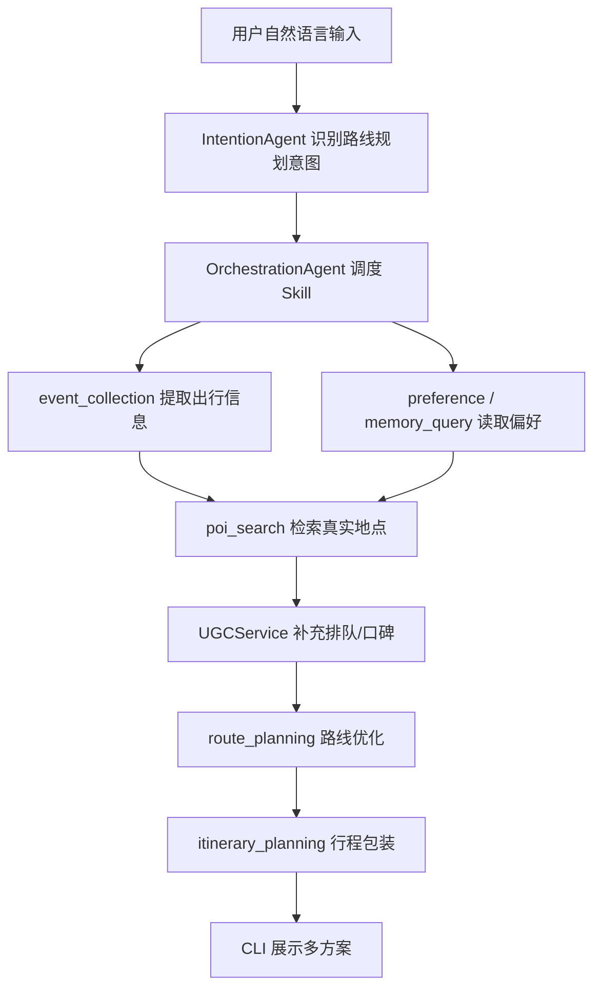

# 智能路线规划系统汇报大纲

建议汇报时长：8-10 分钟  
建议结构：8 页 PPT + 1 次 CLI 演示

## 第 1 页：项目背景与痛点

标题建议：从“搜地点”到“可执行路线”

核心内容：

- 用户出行或游玩时，不只是需要单点推荐，而是需要把多个地点串成可执行路线。
- 典型决策负担包括：想吃好、不想排队、时间有限、距离不能太远、景点和餐饮要兼顾。
- 传统搜索/点评体验需要用户反复筛选、比较、手动组合，决策成本高。

可放内容：

- 用户输入示例：“杭州一日游，想吃好，不想排队，6小时”
- 痛点图：搜索地点 -> 比较评价 -> 估算距离 -> 安排时间 -> 反复调整

讲解重点：

- 我们解决的不是“推荐几个地点”，而是“生成一条能直接照着走的路线”。

## 第 2 页：任务目标与当前成果

标题建议：面向比赛目标的路线规划能力

核心内容：

- 路线生成：支持 3 个及以上地点串联，并输出完整时间安排。
- 多条件约束：同时考虑时间、距离、偏好、预算、排队风险。
- 个性化：结合用户输入和历史偏好，生成差异化方案。
- POI 类型覆盖：当前至少覆盖餐饮 + 文化/娱乐。
- 响应体验：CLI 展示进度，用户不会空等。

当前成果：

- 已接入高德 POI 数据。
- 已实现本地 mock UGC 和启发式排队风险。
- 已实现路线评分和多 profile 优化器。
- 已接入多 Agent 调度链路。
- 已通过单元测试、Skill 链路测试、编排测试和真实高德 smoke test。

讲解重点：

- 当前版本已经能跑完整闭环，不是纯方案设计。

## 第 3 页：系统整体流程

标题建议：LLM 调度 + 工具型规划的混合架构

推荐流程图：



讲解重点：

- LLM 不直接“编路线”，而是负责理解意图和调度。
- 高德、UGC、优化器负责真实数据和确定性计算。
- 这样可以减少幻觉，提高可测试性和可维护性。

## 第 4 页：真实地点与 UGC 数据层

标题建议：高德 POI + UGC 智慧补充

核心内容：

- `AmapClient` 调用高德 Web Service 获取真实地点。
- `PoiSearchAgent` 分别检索餐饮和文化/娱乐地点。
- `UGCService` 用本地 mock 数据补充：
  - 排队风险
  - 标签
  - 口碑关键词
  - 价格等级
  - 游玩/就餐建议
- 对没有命中 UGC 的真实地点，使用启发式规则估计排队风险。

可放代码/模块：

- `services/amap_client.py`
- `services/ugc_service.py`
- `.claude/skills/poi-search/script/agent.py`
- `data/ugc/mock_poi_reviews.json`

讲解重点：

- 高德保证地点真实，UGC 保证选择更贴近“好不好吃、排不排队”。
- mock UGC 是比赛阶段的可控数据源，后续可替换为点评/搜索摘要。

## 第 5 页：路线评分与优化算法

标题建议：从候选地点到多方案路线

核心算法：

```text
poi_score =
  质量分
  - 排队惩罚
  - 预算惩罚
  + 偏好匹配

route_score =
  地点总分
  + 类别覆盖奖励
  + 时间利用奖励
  + 地点数量奖励
  - 交通时间惩罚
  - 超时惩罚
  - 超预算惩罚
  - 午餐时间偏离惩罚
```

优化过程：

1. 过滤缺少坐标的地点。
2. 按餐饮、文化/娱乐等类别保留高分候选。
3. 组合地点，保证至少 1 个餐饮 + 2 个文化/娱乐。
4. 枚举访问顺序。
5. 计算距离、交通时间、停留时间。
6. 生成时间表和路线指标。
7. 按不同 profile 输出多方案。

四类方案：

- 少排队路线
- 均衡路线
- 效率优先路线
- 体验优先路线

可放代码/模块：

- `planning/scoring.py`
- `planning/route_optimizer.py`
- `.claude/skills/route-planning/script/agent.py`

讲解重点：

- 这是确定性优化模块，所以结果可解释、可测试、可调参。

## 第 6 页：多 Agent 与交互体验创新

标题建议：可解释、可扩展的 Skill 调度

核心内容：

- `IntentionAgent` 识别用户是路线规划请求。
- `OrchestrationAgent` 按优先级调度各 Skill。
- `poi_search` 和 `route_planning` 是工具型 Skill，不依赖 LLM。
- `itinerary_planning` 优先使用结构化 `route_options`，避免 LLM 替换真实地点。
- CLI 展示用户友好进度：
  - 正在整理出行信息
  - 正在读取你的偏好
  - 正在检索真实地点
  - 正在优化路线
  - 正在生成行程方案

创新点：

- LLM + Tool Use + 确定性优化融合。
- 结构化路线先生成，再自然语言包装。
- 支持多方案对比，而不是只给单一路线。
- 当意图识别失败时，有本地规则兜底进入路线规划链路。

讲解重点：

- 架构不是简单 prompt，而是“LLM 负责理解，算法负责规划，工具负责真实数据”。

## 第 7 页：测试结果与演示证据

标题建议：已完成端到端验证

测试命令：

```bash
python tests/test_poi_ugc_services.py
python tests/test_route_optimizer.py
python tests/test_route_skill_agents.py
python tests/test_route_orchestration_flow.py
python tests/test_intention_schedule_normalization.py
```

远程测试结果：

- POI Client + UGC Service：7 项通过
- Route Optimizer：6 项通过
- Skill 链路：1 项通过
- Orchestration 流程：1 项通过
- Intention 调度规范化：3 项通过

真实高德测试：

```bash
export AMAP_KEY="高德 Web Service Key"
python tests/smoke_route_pipeline_real.py
```

已验证：

- 成功获取约 24 个真实地点。
- 生成 4 条路线方案。
- 主路线包含餐饮 + 文化/娱乐。
- 输出时间表、排队情况、预算估算和多方案对比。

讲解重点：

- 既有 mock 单元测试，也有真实高德 smoke test，能支撑比赛演示稳定性。

## 第 8 页：现场演示与后续计划

标题建议：演示脚本与下一步增强

现场演示输入：

```text
杭州一日游，想吃好，不想排队，6小时
```

预期展示：

- 系统显示处理进度。
- 输出“杭州智能路线规划”。
- 展示 3 个以上地点。
- 覆盖文化/娱乐和餐饮。
- 给出每个地点的时间段和建议停留。
- 给出“少排队、均衡、效率优先、体验优先”多方案对比。

后续增强：

- 接入高德路径规划 API，使用真实步行/驾车时间。
- 扩展 UGC 数据来源，接入网络搜索摘要或点评数据。
- 增加自然语言调整闭环，例如“换一家更近的餐厅”“不要西湖核心区”。
- 增加前端可视化地图展示。

需要队友敲定：

- 比赛演示城市是否固定杭州。
- UGC 是否继续使用 mock，还是补充网络搜索。
- 是否优先实现路线调整闭环。
- 是否接入真实路径规划 API。

## 备用页：代码改动总览

可在答疑时使用，不一定放主 PPT。

| 模块 | 文件 | 改动说明 |
| --- | --- | --- |
| 高德 POI | `services/amap_client.py` | 封装高德地点检索和字段标准化 |
| UGC | `services/ugc_service.py` | mock UGC 匹配、排队风险和标签补充 |
| 评分 | `planning/scoring.py` | 地点评分、距离、交通时间、预算、排队等计算 |
| 优化 | `planning/route_optimizer.py` | 组合搜索、多 profile 路线、时间表生成 |
| POI Skill | `.claude/skills/poi-search/script/agent.py` | 检索餐饮与文化/娱乐真实地点 |
| 路线 Skill | `.claude/skills/route-planning/script/agent.py` | 解析约束并调用优化器 |
| 行程包装 | `.claude/skills/plan-trip/script/agent.py` | 使用结构化路线生成可读行程 |
| 意图识别 | `agents/intention_agent.py` | 规范化路线规划调度链路 |
| 编排 | `agents/orchestration_agent.py` | 按优先级执行 Skill 并传递前序结果 |
| CLI | `cli.py` | 展示进度、行程、多方案对比 |

## 备用页：一句话总结

我们把 Traveler 从“能回答旅行问题/生成普通行程”的助手，扩展成了一个能结合真实地点、UGC 排队风险和用户偏好，自动生成多方案、可执行城市路线的智能规划系统。

