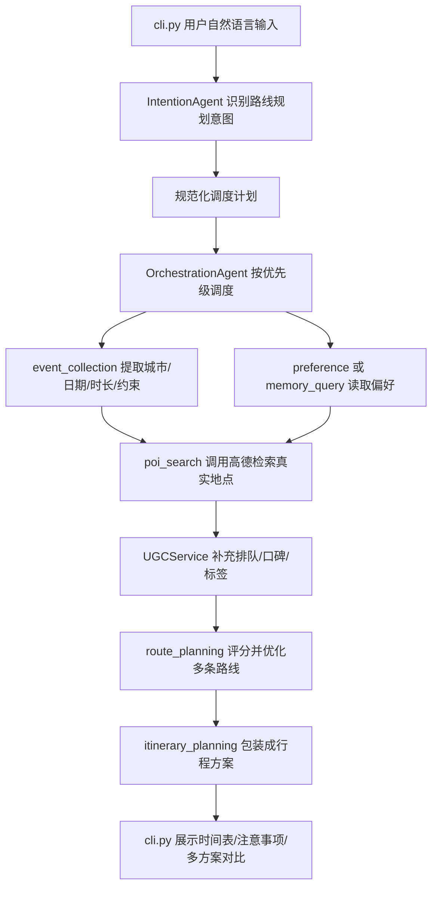

# 智能路线规划系统汇报材料

## 1. 项目定位

本项目在原 Traveler 多智能体商旅助手基础上，新增一个面向“城市游玩/出行”的本地智能路线规划能力。用户只需要输入自然语言目标，例如“杭州一日游，想吃好，不想排队，6小时”，系统会自动完成：

1. 提取出行意图、目的地、时间预算、偏好和约束。
2. 调用高德 Web Service 获取真实地点候选。
3. 使用本地 mock UGC 补充口碑、排队风险、标签和建议。
4. 基于时间、距离、排队、预算、偏好等因素生成多条可执行路线。
5. 将结构化路线包装成用户可读的行程方案，并展示多方案对比。

当前重点覆盖比赛交付目标中的两个核心能力：

- 路线生成：支持至少 3 个地点串联，生成完整时间安排。
- 多条件与个性化：支持时间、距离、餐饮、文化/娱乐、排队、偏好等多条件组合，并输出多方案。

## 2. 当前执行流程

整体链路如下：



对应代码落点：

| 阶段 | 作用 | 主要文件 |
| --- | --- | --- |
| CLI 输入与展示 | 接收自然语言，展示用户友好的处理进度和路线结果 | `cli.py` |
| 意图识别与调度修正 | 识别路线规划请求，确保路线任务包含完整链路 | `agents/intention_agent.py` |
| 多 Agent 编排 | 按优先级执行各 Skill，并把前序结果传给后续 Skill | `agents/orchestration_agent.py` |
| 懒加载与进度提示 | 动态加载 Skill，展示“正在检索真实地点”等非技术提示 | `agents/lazy_agent_registry.py` |
| 高德地点检索 | 封装高德 Web Service POI 查询和字段标准化 | `services/amap_client.py` |
| UGC 补充 | 用本地 mock 数据和启发式规则补充排队、标签、建议 | `services/ugc_service.py` |
| POI 检索 Skill | 搜索餐饮和文化/娱乐地点，去重并过滤低价值候选 | `.claude/skills/poi-search/script/agent.py` |
| 路线优化 Skill | 解析约束和偏好，生成多 profile 路线 | `.claude/skills/route-planning/script/agent.py` |
| 评分与优化器 | 确定性评分、组合搜索、时间表生成 | `planning/scoring.py`, `planning/route_optimizer.py` |
| 行程包装 | 把结构化路线转成可读行程，避免 LLM 换掉真实地点 | `.claude/skills/plan-trip/script/agent.py` |

## 3. 关键算法设计

### 3.1 POI 获取与标准化

`AmapClient` 负责屏蔽高德接口细节，主要使用：

- `/v3/place/text`：按关键词和城市检索地点。
- `/v3/place/around`：预留按坐标附近检索能力。
- `AMAP_KEY`：从环境变量读取，不在代码中硬编码。

返回结果会统一标准化为内部结构：

- `id`, `name`, `type`, `typecode`
- `category`
- `location`
- `rating`, `cost`
- `address`, `cityname`, `business_area`
- `source=amap`

类别判断规则：

- 高德 typecode 以 `05` 开头，或 type 包含“餐饮” -> `dining`
- typecode 以 `08/11/14` 开头，或 type 包含景点、文化、博物馆等 -> `culture_entertainment`
- 其他 -> `other`

`PoiSearchAgent` 当前会分别检索：

- 餐饮：`types=["050000"]`
- 文化/娱乐：`types=["080000", "110000", "140000"]`

并对餐饮结果做一层过滤，降低肯德基、麦当劳、星巴克等连锁快餐在“想吃好”场景中的优先级。

### 3.2 UGC 智慧补充

`UGCService` 负责把点评/评价类信息转成结构化信号。当前采用本地 mock 数据集：

- 数据文件：`data/ugc/mock_poi_reviews.json`
- 匹配方式：优先按 `poi_id`，其次按地点名和 alias 模糊匹配。
- 输出字段：`queue_risk`, `queue_level`, `tags`, `tips`, `rating`, `sentiment_score`, `price_level`

对于没有命中 mock UGC 的真实高德地点，系统不会直接放弃，而是使用启发式规则估计：

- 餐厅在午晚高峰会提高排队风险。
- 西湖、雷峰塔、断桥等热门景区会提高排队风险。
- 博物馆、公园、茶文化、展览类地点会降低排队风险。
- 商圈、热门词会提高餐饮排队风险；社区、小馆、私房等词会降低风险。

这样可以保证真实高德结果即使没有 UGC 命中，也能继续参与规划和排序。

### 3.3 约束解析

`RoutePlanningAgent` 会从用户输入和前序事件信息中解析路线约束：

- `start_time`：默认 `09:00`，支持从“10点”“10:30”提取。
- `total_minutes`：支持“6小时”“360分钟”等表达。
- `min_pois`：至少 3 个地点。
- `max_pois`：时间预算大于等于 300 分钟时允许扩展到 4 个地点。
- `min_dining=1`，`max_dining=1`
- `min_culture_entertainment=2`
- `budget`：支持“预算200”“200元以内”。
- `travel_mode`：默认 auto；若用户提到步行/少打车，可切换步行模式。

这些约束确保路线不是单纯推荐列表，而是满足“餐饮 + 文化/娱乐 + 时间预算”的可执行行程。

### 3.4 多 profile 路线生成

系统不是只给一条路线，而是按 profile 生成多方案：

- `low_queue`：少排队路线，强惩罚排队风险。
- `balanced`：均衡路线，综合质量、距离、排队、预算。
- `efficient`：效率优先路线，更重视交通时间和总时长。
- `experience`：体验优先路线，更重视评分、口碑和偏好匹配。

当用户提到“不想排队、少排队、避峰、人少”等表达时，`low_queue` 会被放到第一位。

### 3.5 路线评分模型

路线优化分两层评分：

第一层是地点分：

```text
poi_score =
  quality_weight * quality
  - queue_weight * queue_risk
  - cost_weight * cost_penalty
  + preference_weight * preference_match
```

其中：

- `quality` 来自高德评分和 UGC 情感分。
- `queue_risk` 来自 UGC 或启发式估计。
- `cost_penalty` 来自人均消费或价格等级。
- `preference_match` 来自标签匹配，例如杭帮菜、文化、室内等。

第二层是路线分：

```text
route_score =
  sum(poi_score)
  + category_diversity_bonus
  + time_fit_adjustment
  + poi_count_bonus
  - travel_penalty
  - overtime_penalty
  - budget_penalty
  - queue_route_penalty
  - meal_timing_penalty
```

核心考虑：

- 必须覆盖餐饮和文化/娱乐，否则强扣分。
- 超出时间预算会扣分。
- 超出预算会扣分。
- 交通时间越长扣分越高。
- 餐饮到达时间偏离午餐窗口会扣分。
- 如果时间预算足够，允许增加第 4 个地点，并给合理利用时间的方案加分。

### 3.6 组合搜索与时间表生成

`RouteOptimizer` 会：

1. 过滤缺少坐标的无效地点。
2. 按类别保留每类前若干高分候选，控制搜索规模。
3. 组合餐饮、文化/娱乐和其他地点，满足类别约束。
4. 对每个组合枚举访问顺序。
5. 计算地点间 haversine 距离。
6. 根据距离估计交通时间。
7. 根据默认停留时间生成到达和离开时间。

默认停留时间：

- 餐饮：60 分钟
- 文化/娱乐：90 分钟
- 其他：45 分钟

输出结构包含：

- `pois`
- `legs`
- `schedule`
- `metrics`
- `constraints`
- `warnings`

因此最终行程能展示具体时间段、交通时间、距离、预算、排队说明和约束满足情况。

## 4. 当前比赛关注点对应情况

### 4.1 完整性

已满足：

- 生成 3 个及以上地点串联路线。
- 同时覆盖餐饮和文化/娱乐两类地点。
- 每个地点有开始时间、结束时间、建议停留时间。
- 路线有总时长、交通时间、距离、预算估算。
- 支持多方案对比。
- 支持时间、预算、排队、距离、偏好等约束进入评分。
- 如果地点候选不足或类别缺失，会返回 warning。

还可以继续增强：

- 高德步行/驾车真实路线时间，目前是本地距离估算。
- 更丰富的 UGC 数据，目前是 mock + 启发式。

### 4.2 创新性

已实现亮点：

- LLM 负责自然语言理解和任务调度，确定性优化器负责可执行路线，降低 LLM 幻觉。
- `poi_search` 和 `route_planning` 是工具型 Skill，不依赖 LLM，响应稳定且便于测试。
- 结构化 `route_options` 先生成，再由 `itinerary_planning` 包装，避免最终回答替换真实高德地点。
- 支持少排队、均衡、效率优先、体验优先四类方案对比。
- CLI 展示面向用户的进度，而不是内部文件或类名。
- 当 LLM 意图识别失败时，`IntentionAgent` 有本地规则兜底，可把旅行/游玩请求拉回路线规划链路。

后续可作为加分扩展：

- 支持“把午饭换成更近的”“不要西湖核心区”“预算降到150”这类基于上一轮方案的局部重规划。
- 接入真实网络 UGC 搜索或点评数据摘要。
- 接入高德路径规划 API，替换当前 haversine + 速度估算。

### 4.3 应用效果

当前工程实践：

- POI、UGC、评分、优化、Skill、CLI 展示分层清晰。
- 高德 API 封装成 `AmapClient`，测试可注入 fake session，不依赖真实网络。
- 路线优化是确定性模块，有独立单元测试。
- 真实高德链路有 smoke test。
- Skill 链路和 Orchestration 链路有端到端测试。

部署方式：

```bash
cd /data2/shared/xst/code/Traveler
export AMAP_KEY="你的高德 Web Service Key"
python cli.py
```

## 5. 测试证据

你在远程服务器上已经验证通过：

```bash
python tests/test_poi_ugc_services.py
python tests/test_route_optimizer.py
python tests/test_route_skill_agents.py
python tests/test_route_orchestration_flow.py
python tests/test_intention_schedule_normalization.py
```

通过结果：

- POI Client + UGC Service：7 项通过
- Route Optimizer：6 项通过
- POI Search + Route Planning Skill 链路：1 项通过
- OrchestrationAgent 路线规划流：1 项通过
- IntentionAgent 调度规范化：3 项通过

真实高德链路：

```bash
export AMAP_KEY="bc2d7d3d16d1fbcd41ea77ccf9d3165f"
python tests/smoke_route_pipeline_real.py
```

已验证现象：

- `REAL PIPELINE OK`
- 成功获取 24 个左右真实地点。
- 生成 4 条路线方案。
- 主路线包含文化/娱乐与餐饮。
- 输出每个地点的时间段、建议停留、等候情况。

CLI 演示已验证输入：

```text
杭州一日游，想吃好，不想排队，6小时
```

已验证输出特点：

- 展示“正在整理出行信息、正在读取你的偏好、正在检索真实地点、正在优化路线、正在生成行程方案”。
- 输出“杭州智能路线规划”。
- 主路线示例：杭州西湖风景名胜区 -> 杭州博物馆 -> 7017浙菜·建德味。
- 总时长约 4 小时 37 分钟。
- 包含少排队、均衡、效率优先、体验优先多方案对比。

## 6. 推荐演示脚本

### 脚本一：主能力演示

输入：

```text
杭州一日游，想吃好，不想排队，6小时
```

讲解重点：

- 系统自动识别这是路线规划请求。
- 自动串联出行信息整理、真实地点检索、路线优化、行程生成。
- 高德返回真实地点，UGC 补充排队风险。
- 主方案满足至少 3 个地点、餐饮 + 文化/娱乐。
- 展示多方案对比，体现“少排队”偏好。

### 脚本二：时间和预算约束演示

输入：

```text
杭州一日游，10点开始，预算200元以内，想吃杭帮菜，看看文化景点，少排队，6小时
```

讲解重点：

- 系统可以提取开始时间、预算、餐饮偏好、文化偏好、少排队偏好。
- 路线评分会考虑时间预算和预算惩罚。
- 餐饮时间会尽量贴近午餐窗口。
- 如果方案超预算或超时，会在约束结果中留下 warning 或降低得分。

### 脚本三：效率优先演示

输入：

```text
杭州半日游，4小时，想紧凑一点，少走路，安排一个好吃的和两个文化景点
```

讲解重点：

- “紧凑、省时间”等表达会让效率优先 profile 前置。
- 优化器会加重交通时间惩罚。
- 输出仍会保证至少 3 个地点，并覆盖餐饮和文化/娱乐。

## 7. 汇报话术建议

可以按这条线讲：

1. 原问题不是“推荐几个地点”，而是“把地点组合成可执行路线”。
2. 我们把系统拆成 LLM 理解层、真实数据检索层、UGC 洞察层、确定性优化层、自然语言展示层。
3. LLM 不直接编路线，避免幻觉；它负责理解和调度。
4. 高德负责真实地点，UGC 负责口碑和排队，优化器负责路线可执行性。
5. 多 profile 让用户能比较：少排队、均衡、效率、体验。
6. 当前已经通过单元测试、Skill 链路测试、编排测试和真实高德 smoke test。
7. 后续增强方向是更真实的 UGC、真实导航时间、以及基于上一轮方案的局部修改闭环。

## 8. 当前需要和队友敲定的问题

建议讨论以下决策：

1. UGC 数据来源：比赛提交时继续使用 mock UGC，还是补充网络搜索摘要作为 UGC 参考。
2. 路线交通时间：是否接入高德路径规划 API，替换当前本地距离估算。
3. 交互闭环：是否实现“基于上一轮路线调整”的增量重规划。
4. 演示城市：建议固定杭州，因为当前测试和 mock UGC 都围绕杭州更稳定。
5. 演示 Key：确认使用高德 Web Service Key，并在演示环境提前 export `AMAP_KEY`。

