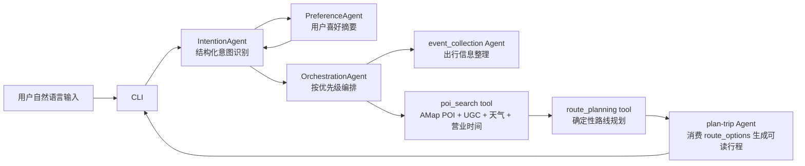
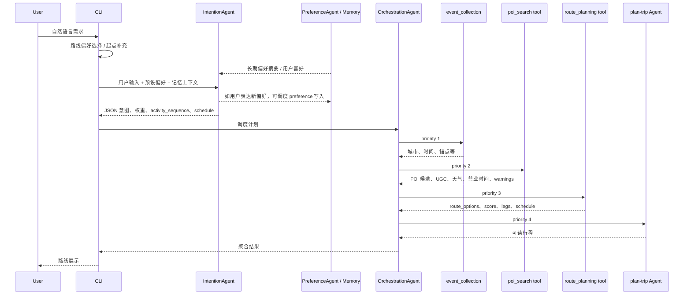

# makeroute 兒途 技术方案文档

##  项目定位

makeroute 兒途是城市内短途游 / 微行程智能规划助手。系统把用户自然语言需求转换成结构化意图，再通过真实 POI 召回、UGC 补齐、天气与营业时间校验、真实路径代价矩阵和确定性路线规划算法，输出多条可执行路线方案。

本方案重点强调：LLM 不直接编路线；核心路线生成由确定性工具完成。

## 整体架构图



## 项目技术栈

| 层级 | 技术 / 组件 | 在项目中的作用 |
| --- | --- | --- |
| 运行语言 | Python 3 | 承载 CLI、Agent、工具调用、路线规划算法和外部服务客户端。 |
| 交互入口 | `cli.py` | 提供命令行交互、路线偏好选择、起点补充、进度提示、健康检查和最终路线展示。 |
| LLM 接入 | OpenAI-compatible Chat API；通过 `LLM_API_KEY`、`LLM_MODEL_NAME`、`LLM_BASE_URL` 配置 | 用于结构化意图识别、偏好理解和最终可读行程表达；不直接生成核心路线。 |
| Agent 框架 | `IntentionAgent`、`OrchestrationAgent`、`.claude/skills/*/script/agent.py` | 将自然语言请求拆解为结构化任务，并按优先级编排子 Agent / Tool 执行。 |
| 插件与懒加载 | `LazyAgentRegistry` | 扫描 `.claude/skills` 下的 skill agent，首次调用时动态导入并缓存，降低启动成本。 |
| 工具注册 | `ToolRegistry` | 统一注册和调用 `poi_search`、`route_planning` 等确定性工具，避免核心能力分散到 Prompt 中。 |
| 地图与 POI 服务 | 高德地图 Web Service API；通过 `AMAP_WEB_SERVICE_KEY` / `AMAP_KEY` 配置 | 用于 POI 召回、地理编码、真实路径距离和通行时间矩阵。 |
| 路线规划算法 | 确定性 Python 路线规划；POI reward scoring、activity slot fulfillment、multimodal cost matrix、route ranking | 根据时间预算、活动顺序、偏好权重、排队风险、天气、营业状态和路径代价生成多条可执行路线。 |
| 交通方式建模 | walking、bicycling、transit、driving、electrobike、multimodal_low_friction | 在无明确交通偏好时默认比较步行、骑行和公共交通，并选择低摩擦 / 时间更优方案。 |
| 天气服务 | `WeatherClient` + wttr.in | 获取天气上下文，影响室内外活动选择、户外适配度和 warning。 |
| UGC 与排队风险 | `UGCService`、本地 mock UGC、启发式估计、可选 web fallback | 为 POI 补充评分、标签、排队风险、适合人群、价格等级和注意事项。 |
| 记忆与偏好 | `MemoryManager`、`PreferenceAgent`、本地 JSON 记忆 | 沉淀长期偏好，并在后续路线规划中作为软约束参与意图识别和路线评分。 |
| 稳定性机制 | `llm_resilience`、`circuit_breaker`、健康检查、warning / strict failure | 为 LLM 和外部服务调用提供重试、熔断、超时回退和明确失败诊断。 |
| 配置管理 | `config.py` + 环境变量 | 集中管理 LLM、高德、RAG、熔断和超时配置；生产环境应避免明文 key。 |
| 数据与缓存 | `data/ugc`、`data/memory`、`data/preferences`、服务级 cache | 存储本地 UGC、用户偏好、历史记忆和外部服务缓存。 |
| 测试与验证 | Python 回归脚本、snapshot / smoke checks、`python cli.py health` | 验证意图识别、POI 召回、路线规划、真实 API 接入和 CLI 健康状态。 |
| 文档表达 | Markdown + Mermaid | 用于维护技术方案、架构图、链路图和部署说明。 |

技术栈边界说明：LLM 主要用于“理解”和“表达”，高德地图、天气、UGC、记忆和路线规划工具负责提供真实约束与可执行数据；最终路线顺序、路径代价、时间预算和评分排序由确定性工具完成。

##  真实实现边界

| 模块 | 当前实现 | 边界说明 |
| --- | --- | --- |
| `CLI` | 已实现 | 负责用户输入、路线偏好选择、起点补充、进度反馈和结果展示；不承担核心路线算法。 |
| `IntentionAgent` | 已实现 | 使用 LLM + 本地规则做结构化意图识别，输出 `route_preference`、`urban_intent_profile`、`activity_sequence` 和 `agent_schedule`。 |
| `PreferenceAgent` / 偏好记忆 | 已实现 | 显式偏好由 `.claude/skills/preference` 中的 `PreferenceAgent` 识别并写入长期记忆；路线规划时长期偏好会作为软偏好摘要传入 `IntentionAgent`、`event_collection` 和工具上下文。 |
| `OrchestrationAgent` | 已实现 | 只负责按 `agent_schedule` 和 priority 编排执行；同优先级可并行；优先通过 `ToolRegistry` 调用工具。 |
| `event_collection Agent` | 已实现 | 提取出行基础信息，如城市、出发地、时间、目的地、缺失信息；不做 POI 召回和路线排序。 |
| `poi_search tool` | 已实现 | 确定性工具；负责 AMap POI 召回、UGC 补齐、天气上下文、营业时间和活动槽候选校验；不决定最终访问顺序。 |
| `route_planning tool` | 已实现 | 确定性工具；不调用 LLM；负责真实路径代价矩阵、活动槽约束、排序、评分和多方案 `route_options`。 |
| `plan-trip Agent` | 已实现 | 消费 `route_options` 生成可读行程；有 route options 时优先走确定性组装，不重新召回地点、不替换主要地点、不重新规划。 |
| 天气 | 部分实现 | `WeatherClient` 接入 wttr.in，失败时 fallback。 |
| UGC | 部分实现 | 本地 mock UGC + 启发式 + 可选 web fallback。 |
| 真实路径代价 | 部分实现 | AMap route matrix 已接入；保留 Haversine fallback 用于离线测试。 |

真实边界总结：

- `IntentionAgent` 和 `plan-trip Agent` 是当前主链路中最主要的 Prompt 使用点。
- `poi_search tool` 和 `route_planning tool` 是核心确定性工具，不是 `.claude` skill，也不应由 LLM 直接替代。
- `PreferenceAgent` 不直接规划路线；它负责识别和沉淀用户偏好，偏好进入后续链路时只作为软约束。
- `plan-trip Agent` 是展示组装层。它可以润色标题、摘要和注意事项，但不能改动 `route_options` 中的地点、顺序、距离、时长、交通方式和评分。

## Prompt 设计策略

makeroute 兒途的 Prompt 设计重点不在“让 LLM 直接生成路线”，而在两个位置：

1. `IntentionAgent`：把用户自然语言需求转换成机器可消费的结构化意图。
2. `plan-trip Agent`：把已经规划好的结构化路线整理成人类友好的表达。

### IntentionAgent Prompt 思路

目标：让 LLM 做“理解和拆解”，不做“路线编排”。

输入信息：

- 用户原始需求，例如“北京短途游，从国贸出发，6小时，想吃本地特色，不想排队”。
- CLI 预设路线偏好，例如美食、打卡、景点餐饮兼顾、自动判断。
- 长期记忆摘要和用户偏好，如餐饮偏好、交通偏好、常用地点。
- 当前规划上下文，如上一轮路线、用户是否在修改当前方案。

要求输出的核心字段：

- `intents`: 用户意图，如 `itinerary_planning`、`preference`、`information_query`。
- `key_entities`: 城市、起点、时长、锚点、同行人等关键实体。
- `route_preference`: 预设或自动识别的路线偏好，包含固定权重字段。
- `urban_intent_profile`: 城市微行程 profile，包括场景、时间窗口、天气上下文、同行人、社交氛围、活动序列、约束。
- `agent_schedule`: 后续要调用的 agent / tool 和 priority。

路线偏好权重固定为：

```json
{
  "sightseeing": 0.0,
  "food": 0.0,
  "experience": 0.0,
  "travel_efficiency": 0.0,
  "queue": 0.0,
  "cost": 0.0
}
```

IntentionAgent Prompt 的设计约束：

- 权重表达偏好强弱，不表达硬性数量约束。
- 硬性路线数量、活动槽满足、时间预算由 `route_planning` 决定。
- 对城市微行程必须输出 `activity_sequence`，例如按摩 -> 夜宵、展览 -> 小酒馆、美甲 -> 小酒。
- 当前显式需求优先级高于长期记忆；长期记忆只作为软偏好。
- 食物、酒馆、活动、同行人、天气、交通偏好应影响标签、召回短语、活动序列或交通方式，而不是直接伪造成最终路线。
- 对路线类请求必须补齐调度链路：`event_collection -> poi_search -> route_planning -> itinerary_planning`。

###  plan-trip Agent Prompt 思路

目标：让 LLM 做“表达整理”，不做“重新规划”。

真实实现分两种情况：

1. **有 `route_options` 时**  
   `.claude/skills/plan-trip/script/agent.py` 会优先调用 `_build_itinerary_from_route_options`，从 `route_options[0]` 生成标题、活动列表、交通说明、餐食建议、注意事项和备选路线。这一路径主要是确定性组装。

2. **没有 `route_options` 或需要兜底时**  
   才使用 plan-trip Agent 的兜底 Prompt，把已收集信息整理成严格 JSON 行程。

plan-trip Prompt 的约束：

- 必须优先使用前序 `route_planning` 或 `route_options` 中的地点顺序、到达/离开时间、交通时间、排队等级和预算指标。
- 不能擅自替换为未出现在 `route_options` 中的主要地点。
- 可以把多个候选路线表达为“效率优先 / 体验优先 / 少排队优先”等用户可理解的方案。
- 如果存在 warning 或约束冲突，必须在 notes 中解释原因和可放宽建议。
- 输出必须是结构化 JSON，便于 CLI 稳定展示。

plan-trip 还包含一个可选的展示文案润色 Prompt，其边界更窄：只能润色 `display_title`、`display_summary` 和 `notes`，不能改地点、顺序、距离、时长、交通方式或评分。

##  Agent 技术细节

###  IntentionAgent

文件：`agents/intention_agent.py`

职责：

- 判断是否为路线 / 行程请求。
- 支持预设路线偏好：打卡、美食、景点餐饮兼顾、自动判断。
- 根据自然语言动态调整权重，例如“不想排队”提高 `queue`，“本地特色”提高 `food`，“citywalk / 轻松”提高 `travel_efficiency` 和 `experience`。
- 输出 `urban_intent_profile`，识别场景、同行人、活动序列、时间窗口、天气偏好和交通方式信号。
- 对路线类请求强制补齐调度链路：`event_collection -> poi_search -> route_planning -> itinerary_planning`。

### PreferenceAgent / 偏好记忆

文件：`.claude/skills/preference/script/agent.py`、`context/memory_manager.py`

职责：

- 识别用户显式表达的长期偏好，例如常驻地、交通方式、餐饮偏好、预算偏好等。
- 区分追加和覆盖，例如“我还喜欢如家”是追加，“我搬家到上海了”是覆盖。
- 由 `MemoryManager` 写入长期记忆。
- 在路线规划链路中，长期偏好会作为软偏好进入 `IntentionAgent` 和后续工具上下文。

边界：

- 不直接生成路线。
- 不直接调用地图服务。
- 不把历史偏好作为硬约束覆盖用户当前明确需求。

### OrchestrationAgent

文件：`agents/orchestration_agent.py`

职责：

- 解析 `agent_schedule`。
- 按 priority 批次执行，同优先级使用 `asyncio.gather`。
- 对 `poi_search` 和 `route_planning` 优先走 `ToolRegistry`，不是 lazy skill。
- 执行失败时聚合 `error_details`，并提前返回，避免无效后续链路。

### LazyAgentRegistry

文件：`agents/lazy_agent_registry.py`

职责：

- 扫描 `.claude/skills/*/script/agent.py`。
- 首次调用时动态导入并缓存 skill agent。
- 明确排除 `poi_search` 和 `route_planning`，因为它们是工具，不是 skill agent。

### ToolRegistry

文件：`tools/registry.py`

职责：

- 注册 `poi_search` 和 `route_planning`。
- 统一 canonical name，支持 `poi-search` / `poi_search` 和 `route-planning` / `route_planning`。
- 将 `context` 和 `previous_results` 传给工具。

### plan-trip Agent

文件：`.claude/skills/plan-trip/script/agent.py`

职责：

- 消费 `route_planning` 输出的 `route_options`。
- 将结构化路线转成 `itinerary`、`daily_plans`、`activities`、`notes`、`route_options` 等 CLI 可展示字段。
- 从路线结果中回填总时长、总距离、出发地、天气上下文和城市微行程 profile。
- 在可选润色阶段，只优化用户可见标题、摘要和提醒。

边界：

- 不重新召回地点。
- 不重新计算路径矩阵。
- 不替换 `route_options` 中的主要地点。
- 不改变路线顺序、距离、时长、交通方式或评分。

##  Agent 编排链路



## 子 agent / skill 插件化与懒加载

`.claude/skills` 中保留的是可懒加载的 Agent 包装入口：

- `event-collection`: 整理出行信息，不做路线求解。
- `plan-trip`: 消费 `route_options`，把结构化路线变成可读行程，不重新规划。
- `memory-query`: 查询历史偏好和行程。
- `preference`: 调用 `PreferenceAgent` 管理用户偏好。
- `query-info`: 实时信息查询。
- `ask-question`: RAG 问答。

懒加载机制：

1. 启动时只扫描 metadata 和 `script/agent.py` 路径。
2. 首次调用某个 skill 时动态 import。
3. 实例化后放入 `_agent_cache`。
4. 工具型模块 `poi_search` / `route_planning` 不进入 lazy skill，避免核心算法分散。

## 安全熔断与稳定性机制

已实现机制：

- LLM 调用重试：`utils/llm_resilience.py` 提供指数退避。
- 熔断器：`utils/circuit_breaker.py` 在连续失败后暂停调用。
- 健康检查：`python cli.py health`。
- 记忆摘要超时回退：长记忆摘要失败时使用缓存或结构化记忆。
- 严格失败：POI、路径矩阵、活动槽为空、时间预算不满足时返回 `error_type`、`warnings`、`diagnostics`。
- CLI 中断与编辑：执行过程中支持 `/cancel` 和 `/edit`。

当前风险：

- `config.py` 存在历史兼容的硬编码 key 回退逻辑。部署时应改为只读取环境变量，并清理仓库中的密钥痕迹。本文档不展示任何 key。

## POI 召回策略

文件：`tools/poi_search_tool.py`

输入：

- 城市、起点、锚点、路线偏好、用户偏好、时间预算、`urban_intent_profile`、天气上下文。

策略：

- 优先根据 `activity_sequence` 生成活动槽召回 spec。
- 有起点时使用 AMap around search，半径随时长调整：短行程更近，长行程更宽。
- 无活动槽时按偏好权重构造动态 phrase bank：
  - `food`: 本地特色、老字号、小吃、必吃美食。
  - `sightseeing`: 地标、打卡、热门景点、拍照夜景。
  - `experience`: 文化体验、展览、博物馆、特色体验。
  - `travel_efficiency`: citywalk、商圈、地铁沿线。
  - `queue`: 人少景点、不排队美食。
  - `cost`: 平价美食、免费景点。
- 过滤低价值泛连锁餐饮，避免“关键词命中但体验不匹配”。
- 活动槽候选必须通过 `route_planning_tool.activity_slot_fulfillment` 校验。

## UGC 补齐策略

文件：`services/ugc_service.py`

当前实现：

- 本地 mock UGC：`data/ugc/mock_poi_reviews.json`。
- 可选 web fallback：通过 `TRAVELER_ENABLE_WEB_UGC=1` 开启。
- 没有匹配 UGC 时使用启发式估计排队风险和标签。

补齐字段：

- `queue_risk`
- `queue_level`
- `rating`
- `sentiment_score`
- `tags`
- `review_keywords`
- `price_level`
- `suitable_for`
- `tips`
- `source`

## 天气与营业时间接入

天气：

- `services/weather_client.py` 调用 wttr.in。
- 输出 `condition`、`temperature_c`、`precipitation_risk`、`wind_risk`、`outdoor_suitability`、`indoor_preferred`、`warnings`。
- 查询失败时返回 `source=unavailable` 和 warning。

营业时间：

- AMap POI detail / extensions 中的营业字段由 `services/opening_hours.py` 归一化。
- POI 侧补齐 `opening_hours`、`opening_status`、`opening_hours_warning`。
- route planning 会把营业状态纳入可访问性和 warning。

## 路径规划算法

文件：`tools/route_planning_tool.py`

核心流程：

1. 从 `context` 和 `previous_results` 提取城市、时长、起点、偏好、POI、活动序列。
2. 标准化 POI 并计算每个 POI 的 reward。
3. 推断 composition policy，例如 `food_focused`、`culture_focused`、`balanced`、`low_queue`、`citywalk`。
4. 根据交通方式构建路径代价矩阵。
5. 对城市微行程按 activity_sequence 求解活动槽路线。
6. 对普通短途游枚举 POI 组合并排序访问顺序。
7. 计算总时间、距离、换乘、排队风险、成本、天气适配、营业状态、偏好匹配。
8. 输出最多 3 条 `route_options`。

评分考虑：

- POI 质量：rating、UGC、标签。
- 偏好匹配：food、sightseeing、experience 等。
- 排队风险：`queue_risk` 越高惩罚越大。
- 成本敏感：成本越高可能被惩罚。
- 起点距离与路径代价。
- 时间预算适配。
- 天气与室内外适配。
- 活动槽满足度。

## 真实路径代价矩阵

文件：`services/amap_client.py` 中 `AmapRouteClient`。

支持：

- walking
- bicycling
- transit
- driving
- electrobike
- multimodal_low_friction

实现要点：

- 起点作为虚拟节点加入矩阵。
- `build_route_cost_matrix` 生成 `distance_matrix`、`duration_matrix`、`source_matrix`、`mode_matrix`、`candidate_modes_matrix`。
- multimodal 模式默认比较 walking、bicycling、transit，并根据最快、最短、少换乘、少步行等 profile 选择。
- CLI 初始化 `ToolRegistry` 时对 route planning 开启 `auto_use_amap_route_matrix=True` 和 `strict_no_fallback=True`。
- 工具直接测试时可使用 Haversine fallback，以保证纯 Python 检查不依赖网络。

## 性能优化方法

当前已实现：

- 同 priority agent 可并行。
- LazyAgentRegistry 懒加载 skill agent。
- AMapRouteClient 有 pair cache。
- WeatherClient 有短期缓存。
- UGC web fallback 有 cache 文件。
- CLI 先展示“已收到路线需求”，再执行慢调用。
- 长记忆摘要超时后使用缓存，不阻塞主链路。

后续优化：

- 为 POI recall spec 做请求级缓存。
- 为路线矩阵增加跨请求缓存。
- 增加流式进度条和可视化地图。
- 引入异步 AMap 批量请求。

## 部署方案

本地部署：

```powershell
python -m venv .venv
.\.venv\Scripts\Activate.ps1
python -m pip install --upgrade pip
python -m pip install -r requirements.txt
$env:LLM_API_KEY="your-llm-api-key"
$env:LLM_MODEL_NAME="your-model-name"
$env:LLM_BASE_URL="https://your-llm-endpoint/v1"
$env:AMAP_WEB_SERVICE_KEY="your-amap-web-service-key"
python cli.py
```

服务器部署详见 [deployment.md](deployment.md)。

## 安全性与稳定性设计

- API key 只应通过环境变量或安全配置注入，不应写入文档、日志或提交记录。
- 输出 diagnostics 时不包含 key。
- AMap 请求失败、路径矩阵失败、活动槽缺失时严格返回错误，不伪造路线。
- 对外部服务失败采用 warning / fallback / strict failure 三类策略区分。
- 所有核心工具可通过纯 Python 脚本回归验证。

## 示例案例与合理性分析

### 案例 1：美食短途

输入：`北京短途游，从国贸出发，6小时，想吃本地特色，不想排队`

- 用户意图：北京 6 小时美食优先微行程，低排队。
- 活动序列：本地特色餐饮 -> 轻量文化 / citywalk -> 本地小吃或特色餐饮。
- POI 召回重点：国贸周边、本地特色、老字号、小吃、低排队餐饮。
- 路径规划重点：起点国贸进入矩阵，餐饮质量和 queue penalty 权重大，至少串联 3 个 POI。
- 合理性：满足“吃本地特色”和“不想排队”，同时用一个文化 / 步行节点连接行程，避免纯吃饭路线过短。
- warning：热门餐厅现场排队可能变化；需确认营业时间。

### 案例 2：拍照打卡

输入：`北京短途游，从国贸出发，6小时，想多拍照打卡，少排队`

- 用户意图：北京 6 小时打卡拍照路线，兼顾低排队。
- 活动序列：拍照地标 / 展览 -> citywalk / 文化街区 -> 轻餐饮。
- POI 召回重点：地标、拍照、夜景、文化街区、人少景点。
- 路径规划重点：提高 sightseeing 与 queue 权重，选择适合串联的文化娱乐点。
- 合理性：用多个视觉体验点构成主题，餐饮只作为补充。
- warning：户外拍照受天气影响；部分场馆可能需预约。

### 案例 3：citywalk

输入：`我在天安门，想要进行3小时的citywalk，请为我推荐一条轻松的路线`

- 用户意图：从天安门出发，低强度 3 小时步行路线。
- 活动序列：公共空间 / 地标外观 -> 历史街区 -> 休息点。
- POI 召回重点：天安门周边、胡同、历史街区、公园、轻松散步。
- 路径规划重点：walking 或 multimodal_low_friction，距离约束更严格，降低换乘和步行压力。
- 合理性：3 小时 citywalk 不适合拉远距离，路线应围绕起点附近串联。
- warning：部分地标仅建议外观打卡；安检、预约和开放时间需现场确认。

### 案例 4：下班放松夜宵

输入：`北京，我一下班想去按摩放松，然后吃个夜宵，大概3小时`

- 用户意图：下班后低能量放松路线。
- 活动序列：wellness / massage -> late_night_food。
- POI 召回重点：按摩、足疗、SPA、夜宵、烧烤、小吃。
- 路径规划重点：活动顺序必须先按摩后夜宵；营业时间要适配晚间；距离不能太远。
- 合理性：先放松再进食符合用户语义和时间窗口。
- warning：按摩和夜宵营业时间变化大；低质量 POI 会被硬过滤但仍需确认。

### 案例 5：情侣雨天约会

输入：`下雨了，想和女朋友在北京约会，看看展览，再找个安静小酒馆，4小时`

- 用户意图：雨天情侣室内约会。
- 活动序列：museum_exhibition -> drinks。
- POI 召回重点：展览、美术馆、博物馆、安静酒馆、清吧、室内。
- 路径规划重点：weather_context 标记 rain，优先室内；按展览到小酒馆顺序。
- 合理性：雨天减少户外，安静和 conversation friendly 符合情侣约会。
- warning：展览可能需要预约；酒馆营业时间需确认。

### 案例 6：闺蜜美甲小酒

输入：`今天下午无事可做，和闺蜜想去做指甲和点小酒，大概5小时行程`

- 用户意图：闺蜜下午到傍晚休闲路线。
- 活动序列：beauty / nail -> drinks -> 可选轻餐或拍照点。
- POI 召回重点：美甲、美容、清吧、小酒、适合聊天。
- 路径规划重点：活动槽类型必须匹配，过滤美甲培训、诊所等错误 POI。
- 合理性：先美甲后小酌符合时间和社交节奏。
- warning：美甲需要预约；酒类场所下午营业可能不足。
